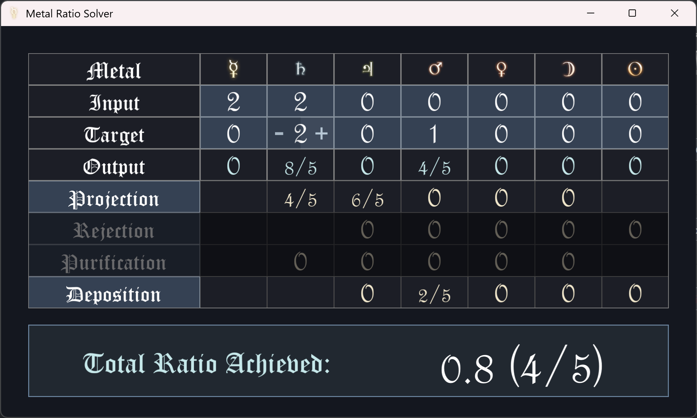

# Metal Solver

## What is this?
This is Metal Rate Solver. Yes, I'm bad at naming things. It solves rate/throughput problems with metals in Opus Magnum. You give it the inputs and outputs of a puzzle, and it tells you what transmutations to do to maximize the rate. Rate means the speed at which you make outputs, regardless of how long it takes you to set up. It supports all 4 vanilla + DLC transmutations and the code can easily be modified to support modded metals or transmutations. 
## How do I use it?
Just click on any of the light blue areas. The input and target rows describe how much of that atom you have as your input/output, and clicking the transmutations toggles whether each one is allowed. 
The numbers below represent how many times to use each transmutation on each atom. For example if the number under gold and division is 3/2, that means that every time you take out 2 sets of gold atoms, you should use division on 3 single gold atoms. Ratios can be higher than 1 if you have multiple atoms in your input set.
The big box at the bottom tells you your final optimal ratio of input to output.
## How do I download it?
Just download metal_solver.exe from the repo. I have no idea how to do releases yet but I'll probably get on that eventually. You'll need to download it, then run it. You don't need to install anything else to run it, and it won't mess with any of your Opus Magnum files or anything like that.
## Is this a virus?
If you see a popup saying "Windows protected your PC" or something like that, it doesn't mean this is a virus. It just means that the program was built by me, and Windows doesn't know who I am and doesn't trust me. If you trust me, you can click "Learn more" and "Run anyway". If you don't trust me either (I am a stranger on the internet after all), you can read through the code to look for anything suspicious, then compile it yourself by following the instructions below.
## How do I compile it myself?
Step 1: Install Rust and Cargo from https://www.rust-lang.org/tools/install
Step 2: Download the source code and unzip it into a folder
Step 3: Right click the folder, and click "Open in Terminal"
Step 4: Run `cargo build --release` to compile it
Step 5: Look in the `target/release` folder for the executable file, which should be called `metal_solver.exe`. You can move that wherever you want and run it without needing Rust or Cargo anymore.
## How do I add my own transmutations or metals?
Adding transmutations is designed to be as easy as possible. Just add a new entry to the `Transformation` enum, then add it to all the lists below for things like the name. Don't forget to increase Transformation::COUNT by 1 as well.
Then, in solver.rs, you'll need to define how the transmutation affects each metal. You can look at the existing transmutations for examples of how to do this. 
Adding metals is more complicated. You'll need to add a new texture, add it to a bunch of lists and such, and redefine all the transmutations in solver.rs. I haven't gone through and made it easy like I have for transmutations, but if you look through the code you should be able to figure out how to do it.
## How does this work?
The solver uses linear programming to find the optimal solution. It sets up a system of linear equations based on the input and output ratios, and the effects of each transmutation. The code for this is in solver.rs and is well commented.
## What about the rest of it?
The UI uses macroquad, which is a simple game framework for Rust. I wrote my own engine for finding optimal text sizes for another project and imported it here, which basically checks how large the text (like 3x taller than the box you need to draw it in) and then scales it down (like to 1/3 scale). The fonts come from windows's built in Old English and French Script fonts. The symbols all come straight from the game files. Model.rs has all the data structures like the list of metals and transmutations, and some helper functions for working with them. It also has the surprisingly details number functions that truncate it to the right number of decimals, make it cut off at the repeat point if it's a repeating decimal, and turn it into a fraction unless it's too complicated in which case it ends up as a number. The UI handles everything you see, solver handles everything you don't. main.rs basically just sets things up and then tells the UI what to do, and if the UI detects that you changed one of the variables it re-solves the equation.
## How is this so fast?
Linear programming turns out to be pretty efficient for this kind of problem, and the number of variables is small enough that it runs basically instantly. Transmuting 100 atoms is the same as transmuting 1 atom times 100, which makes it extremely easy for computers to solve and think about. The slowest part of the program is actually just drawing the UI.
## Can I run this in my browser?
No, not yet, but I might make that possible eventually. Rewriting the UI would be pretty easy but I have no idea how to use webassembly and I have no interest in rewriting this for javascript.
## Can you add this feature?
Depends on how fun I think it'll be to work on. Message me on discord if you have an idea and I'll see what I can do.
# Credits/License:
All code written by me (Nodrance) except for proliferation code which was written by 🌷 and the decimal to fraction function which is credited inline and was integrated into the project by 🌷. Images are from Opus Magnum by Zachtronics, used without permission. Icon was made by me. Fonts are from windows. License is CC-BY-SA for everything written by me, which means "do whatever you want as long as you give credit, and if you make something using this then it also has to be CC-BY-SA".